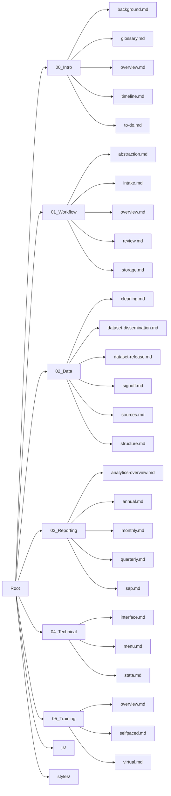

# Site Map Diagram

```mermaid
graph LR
  A[Root]

  A --> Intro[00_Intro]
  Intro --> IntroBG[background.md]
  Intro --> IntroGloss[glossary.md]
  Intro --> IntroOverview[overview.md]
  Intro --> IntroTimeline[timeline.md]
  Intro --> IntroTodo[to-do.md]

  A --> Workflow[01_Workflow]
  Workflow --> WFAbstraction[abstraction.md]
  Workflow --> WFIntake[intake.md]
  Workflow --> WFOverview[overview.md]
  Workflow --> WFReview[review.md]
  Workflow --> WFStorage[storage.md]

  A --> Data[02_Data]
  Data --> DataCleaning[cleaning.md]
  Data --> DataDissem[dataset-dissemination.md]
  Data --> DataRelease[dataset-release.md]
  Data --> DataSignoff[signoff.md]
  Data --> DataSources[sources.md]
  Data --> DataStructure[structure.md]

  A --> Reporting[03_Reporting]
  Reporting --> RptAnalytics[analytics-overview.md]
  Reporting --> RptAnnual[annual.md]
  Reporting --> RptMonthly[monthly.md]
  Reporting --> RptQuarterly[quarterly.md]
  Reporting --> RptSAP[sap.md]

  A --> Technical[04_Technical]
  Technical --> TechInterface[interface.md]
  Technical --> TechMenu[menu.md]
  Technical --> TechStata[stata.md]

  A --> Training[05_Training]
  Training --> TrainOverview[overview.md]
  Training --> TrainSelf[selfpaced.md]
  Training --> TrainVirtual[virtual.md]

  A --> JS[js/]
  A --> Styles[styles/]
```
