# BNR Refit – Project To-Do List

Tracking the major jobs of the BNR refit.

---
## To Do List (July-2025)
### STAGE 0. Pre-Analytics

```mermaid 
kanban
  🟥 Not Started

  🟨 In Progress
    cvd-dat       [CVD dataset]@{ assigned: Jacqui, priority: High }
    cvd-do        [CVD Stata **DO** files]@{ assigned: Jacqui, priority: High }
    cvd-doc       [CVD documents]@{ assigned: Jacqui, priority: High }
    ami-data      [Assess 2024 AMI paper dataset: in Cureus]@{ assigned: Ian, priority: }
    ami-p159      [Review prject folder - p159 - AMI survival]@{ assigned: Ian , priority: }
    build-ex      [Build suggested folder-structure]@{ assigned: Ian , priority: }
    build-ex      [Build example Stata structure]@{ assigned: Ian , priority: }
    githib        [GitHub repo for cloning]@{ assigned: Ian, priority: }

  🟩 Done
    gantt         [Gantt chart]@{ assigned: Ian, priority: }
    folder        [Project folder: bnr-refit]@{ assigned: Ian, priority: }

```

  
### STAGE 1. System Assessment

```mermaid 
kanban
  🟥 Not Started
    audit           [Audit report on 2024 CVD **DO** files]@{ assigned: , priority: High }

  🟨 In Progress
    sop-release   [**SOP Data:** Release data]@{ assigned: , priority: }
    sop-diss      [**SOP Data:** Disseminate data]@{ assigned: , priority: }

  🟩 Done

```

Analytics & Reporting

### STAGE 2. Analytics Refit

```mermaid 
kanban
  🟥 Not Started
    do-annual      [Stata Do files - annual report]@{ assigned: , priority: High }
    do-month       [Stata Do files - monthly report]@{ assigned: , priority: High }
    do-other       [Stata Do files - ad-hoc reporting]@{ assigned: , priority: High }
    dialog         [Develop plan for dialog boxes]@{ assigned: , priority: High }

    sop-source     [**SOP Data/sources:** Map - BNR data sources]
    sop-clean      [**SOP Data/cleaning:** Post-REDCap data cleaning]
    sop-struct     [**SOP Data/structure:** The data dictionary]
    sop-signoff    [**SOP Data/signoff:** REDCap signoff process]
    sop-goals      [**SOP Reporting/Overview:** The goals of the analytics]
    sop-sap        [**SOP Reporting/SAP:** Statistical Analysis Plan]
    sop-month      [**SOP Reporting/Monthly:** Analytics + reporting]
    sop-annual     [**SOP Reporting/Annual:** Analytics + reporting]
    sop-other      [**SOP Reporting/Other:** Analytics + reporting]
    sop-stata      [**SOP Technical/stata:** Descriptions of algorithms]

  🟨 In Progress

  🟩 Done

```

### STAGE 3. Code-Free Access

```mermaid 
kanban
  🟥 Not Started
    menu-str     [Develop Stata menu structure]@{ assigned: , priority: High }
    menu-imp     [Implement Stata menu structure]@{ assigned: , priority: High }

    sop-post     [**SOP Technical/menu:** Menuing system]
    sop-post     [**SOP Technical/interface:** No-code dialogue boxes]

  🟨 In Progress

  🟩 Done

```

### STAGE 4. System Documentation & Training

```mermaid 
kanban
  🟥 Not Started
    train        [Develop Asynchronous training plan]@{ assigned: , priority: High }
    sop-post     [**SOP Training/overview:** Training overview]
    sop-post     [**SOP Training/overview:** Self-paced learning]
    sop-glossary [**SOP WorkFlow:** website glossary]@{ assigned: , priority: }
    sop-pre      [**SOP Workflow:** Approved BNR workflow - pre-REDCap]@{ assigned: , priority: }
    sop-redcap   [**SOP Workflow:** Approved BNR workflow - REDCap]@{ assigned: , priority: }
    sop-post     [**SOP Workflow:** Approved BNR workflow - post-REDCap]@{ assigned: , priority: }
    sop-store    [**SOP Workflow:** storing REDCap-external datasets be stored]  

  🟨 In Progress

  🟩 Done

```

### EXTRA. Potential additional Work

```mermaid 
kanban
  🟥 Not Started
    case-com    [Explore methods for case-completeness]  
    monitor1    [**DO** file - monitor cases]@{ assigned: , priority: }
    data-teach  [Develop dummy data for teaching]

  🟨 In Progress

  🟩 Done

```

  

