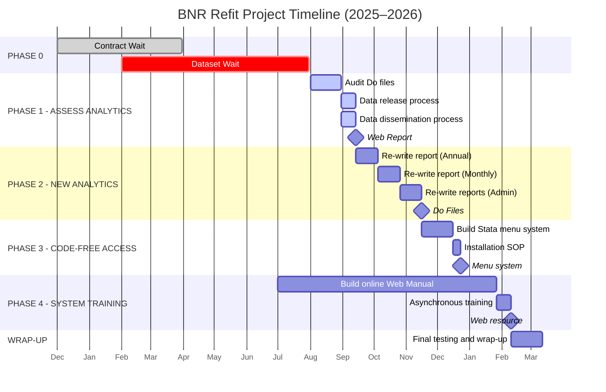

# BNR Refit Project Timeline (2025–2026)

This timeline outlines the planned activities for the BNR Refit Project, which runs from January 2025 to March 2026. The project focuses on enhancing analytics, automating report generation, simplifying access via a code-free interface, and building robust training resources for staff. It is organized into four key phases and includes time for wrap-up and final testing.

